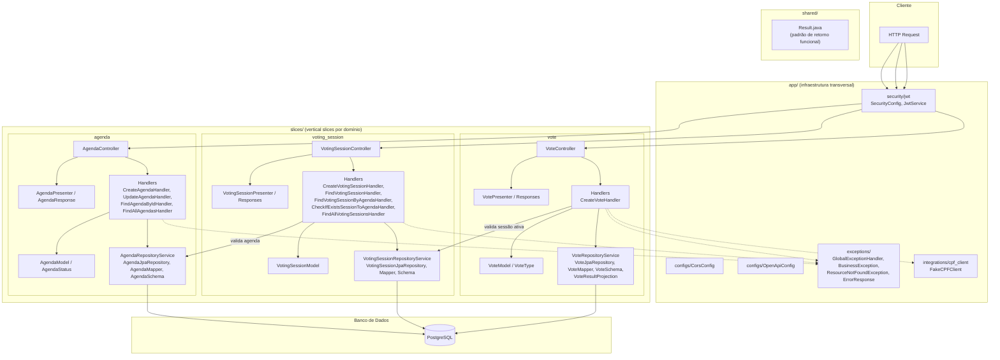
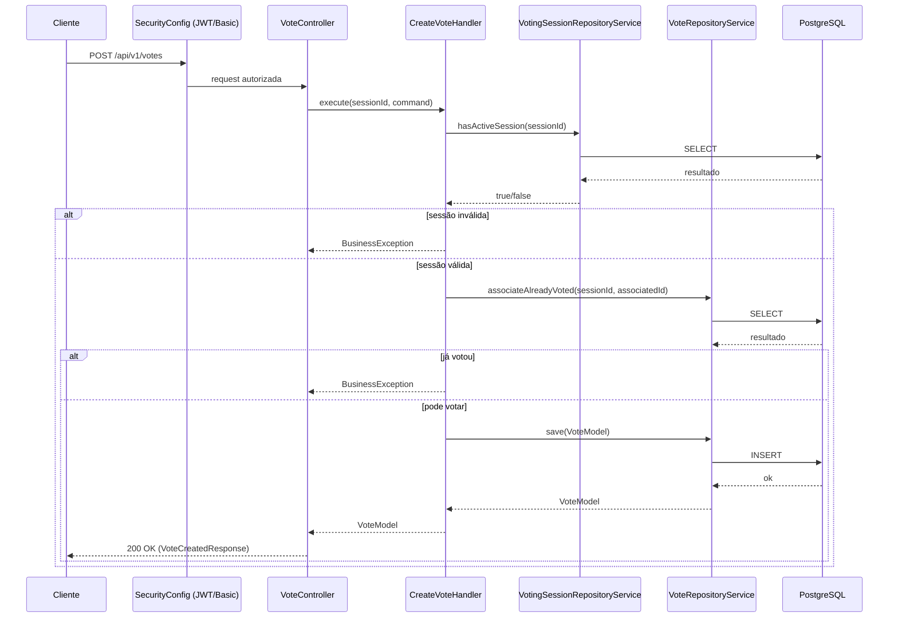
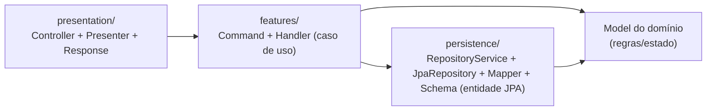

# Arquitetura — dbserver-voting-api

Arquitetura em **Vertical Slices** (organizada por funcionalidade/domínio, não por camada técnica), sobre Spring Boot + PostgreSQL.

## Visão geral em camadas

## Fluxo de uma requisição (exemplo: criar voto)

## Camadas por slice (padrão repetido em agenda / voting_session / vote)

**Convenções observadas:**

- Cada slice (`agenda`, `voting_session`, `vote`) tem sua própria pasta com `features/` (casos de uso), `persistence/` (acesso a dados) e `presentation/` (HTTP).
- `Handler` = caso de uso único (CQRS-like); `Command` = DTO de entrada.
- `Schema` = entidade JPA; `Mapper` converte `Schema` ↔ `Model` de domínio.
- `RepositoryService` encapsula o `JpaRepository` e expõe métodos de domínio (ex.: `hasActiveSession`, `associateAlreadyVoted`).
- `app/` contém preocupações transversais (segurança, exceções, configs, integrações externas).
